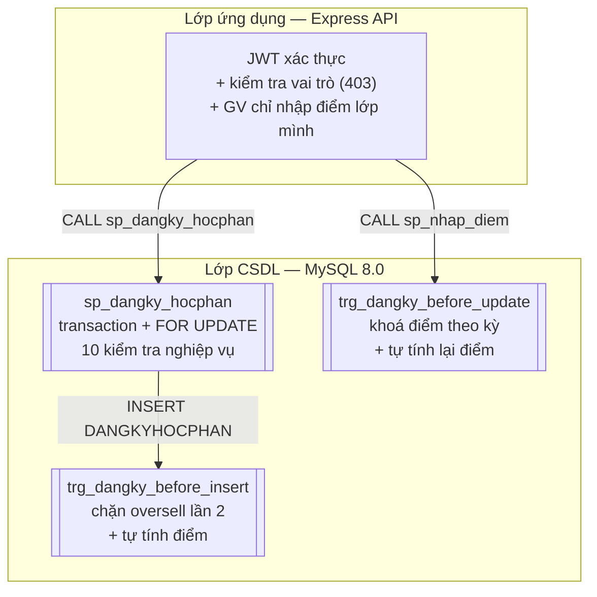

# ERD & Mô tả Schema — CSDL `qlhocphan`

> Nguồn chân lý: `db/01_schema.sql` (MySQL 8.0+, InnoDB, `utf8mb4_unicode_ci`).
> Tài liệu mô tả **trạng thái hiện tại** của schema, gồm: ERD, mô tả từng bảng, ràng buộc toàn vẹn, index, và các đối tượng lập trình trong DB (function / procedure / trigger / view).

---

## 1. Sơ đồ ERD

Sơ đồ render trực tiếp trên GitHub (Mermaid). Ghi chú trong dấu `"..."` là ràng buộc/mô tả bổ sung.

```mermaid
erDiagram
    KHOA {
        varchar(5)   MAKHOA  PK
        varchar(100) TENKHOA
    }
    GIANGVIEN {
        varchar(10)  MAGV     PK
        varchar(50)  HOTEN
        date         NGAYSINH
        tinyint(1)   GIOITINH "0=nữ, 1=nam"
        varchar(30)  HOCVI
        varchar(5)   MAKHOA   FK
        varchar(100) EMAIL    UK
    }
    SINHVIEN {
        varchar(10) MASV        PK
        varchar(50) HOTEN
        date        NGAYSINH
        tinyint(1)  GIOITINH    "0=nữ, 1=nam"
        varchar(5)  MAKHOA      FK
        date        NGAYNHAPHOC
        enum        TRANGTHAI   "đang học | bảo lưu | thôi học | tốt nghiệp — mặc định đang học"
    }
    HOCPHAN {
        varchar(10) MAHP     PK
        varchar(100) TENHP
        tinyint     SOTINCHI "unsigned, CHECK > 0"
        smallint    SOTIETLT "unsigned, số tiết lý thuyết"
        smallint    SOTIETTH "unsigned, số tiết thực hành"
        enum        LOAIHP   "bắt buộc | tự chọn"
        varchar(5)  MAKHOA   FK
    }
    HOCPHAN_TIENQUYET {
        varchar(10) MAHP           PK "FK → HOCPHAN, tự tham chiếu"
        varchar(10) MAHP_TIENQUYET PK "FK → HOCPHAN, cấm trùng MAHP (trigger)"
    }
    HOCKY {
        varchar(20) MAHK         PK
        varchar(9)  NAMHOC       "vd: 2025-2026"
        tinyint     HOCKYTHU     "1..3"
        date        NGAYBATDAU
        date        NGAYKETTHUC
        datetime    HANDANGKY_BD "hạn đăng ký học phần"
        datetime    HANDANGKY_KT
        tinyint     KHOADIEM     "1 = đã khoá bảng điểm"
    }
    LOPHOCPHAN {
        varchar(15) MALHP      PK
        varchar(10) MAHP       FK
        varchar(20) MAHK       FK
        varchar(10) MAGV       FK
        smallint    SISOMAX    "unsigned, CHECK > 0"
        varchar(20) PHONGHOC
        tinyint     THU        "2..8 (8 = Chủ nhật)"
        tinyint     TIETBATDAU "1..12"
        tinyint     SOTIET     "số tiết một buổi"
        enum        TRANGTHAI  "mở | đóng | huỷ — mặc định mở"
    }
    DANGKYHOCPHAN {
        varchar(10)  MASV          PK "FK → SINHVIEN (ON DELETE CASCADE)"
        varchar(15)  MALHP         PK "FK → LOPHOCPHAN (ON DELETE RESTRICT)"
        datetime     NGAYDANGKY    "mặc định CURRENT_TIMESTAMP"
        enum         LANHOC        "lần 1 | học lại | cải thiện"
        decimal(4,2) DIEMCHUYENCAN "0..10"
        decimal(4,2) DIEMGIUAKY    "0..10"
        decimal(4,2) DIEMCUOIKY    "0..10"
        decimal(4,2) DIEMHE10      "TỰ TÍNH: 10%CC + 30%GK + 60%CK"
        char(2)      DIEMCHU       "TỰ TÍNH: fn_diem_chu"
        decimal(3,2) DIEMHE4       "TỰ TÍNH từ DIEMCHU"
        enum         TRANGTHAI     "đăng ký | đã huỷ"
    }
    TAIKHOAN {
        int          MATK         PK "AUTO_INCREMENT"
        varchar(50)  TENDANGNHAP  UK
        varchar(255) MATKHAU_HASH "bcrypt"
        enum         VAITRO       "sinhvien | giangvien | admin"
        varchar(10)  MASV         FK "nullable — chỉ khi vai trò sinhvien"
        varchar(10)  MAGV         FK "nullable — chỉ khi vai trò giangvien"
    }

    KHOA                 ||--o{ GIANGVIEN        : "thuộc"
    KHOA                 ||--o{ SINHVIEN         : "thuộc"
    KHOA                 ||--o{ HOCPHAN          : "soạn giảng"
    HOCPHAN              ||--o{ HOCPHAN_TIENQUYET : "yêu cầu tiên quyết"
    HOCPHAN              ||--o{ HOCPHAN_TIENQUYET : "là tiên quyết của"
    HOCPHAN              ||--o{ LOPHOCPHAN       : "mở lớp"
    HOCKY                ||--o{ LOPHOCPHAN       : "sắp lịch"
    GIANGVIEN            ||--o{ LOPHOCPHAN       : "phụ trách"
    SINHVIEN             ||--o{ DANGKYHOCPHAN    : "đăng ký"
    LOPHOCPHAN           ||--o{ DANGKYHOCPHAN    : "nhận đăng ký"
    SINHVIEN             ||--o| TAIKHOAN         : "sở hữu"
    GIANGVIEN            ||--o| TAIKHOAN         : "sở hữu"
```

**Ghi chú cardinality:**

| Quan hệ | Cardinality DB | Ghi chú |
|---|---|---|
| KHOA → GIANGVIEN / SINHVIEN / HOCPHAN | 1:N | `ON UPDATE CASCADE, ON DELETE RESTRICT` — không xoá khoa còn dữ liệu |
| HOCPHAN ↔ HOCPHAN (qua `HOCPHAN_TIENQUYET`) | N:N tự tham chiếu | `ON DELETE CASCADE` cả hai chiều; trigger cấm một học phần tự là tiên quyết của chính nó |
| HOCPHAN → LOPHOCPHAN | 1:N | RESTRICT khi xoá |
| HOCKY → LOPHOCPHAN | 1:N | RESTRICT khi xoá |
| GIANGVIEN → LOPHOCPHAN | 1:N | RESTRICT khi xoá |
| SINHVIEN → DANGKYHOCPHAN | 1:N | **CASCADE khi xoá** (xoá SV thì mất đăng ký) |
| LOPHOCPHAN → DANGKYHOCPHAN | 1:N | RESTRICT — không xoá lớp đã có đăng ký |
| SINHVIEN/GIANGVIEN → TAIKHOAN | 1:1 nghiệp vụ (FK cho phép 1:N) | Trigger `trg_tk_role_*` buộc MASV/MAGV khớp vai trò; CASCADE khi xoá |

---

## 2. Mô tả schema từng bảng

### 2.1 `KHOA` — đơn vị đào tạo

| Cột | Kiểu dữ liệu | Ràng buộc | Mô tả |
|---|---|---|---|
| MAKHOA | VARCHAR(5) | **PK** | Mã khoa (vd: `CNTT`) |
| TENKHOA | VARCHAR(100) | NOT NULL | Tên khoa |

### 2.2 `GIANGVIEN` — giảng viên

| Cột | Kiểu dữ liệu | Ràng buộc | Mô tả |
|---|---|---|---|
| MAGV | VARCHAR(10) | **PK** | Mã giảng viên (vd: `gv01`) |
| HOTEN | VARCHAR(50) | NOT NULL | Họ tên |
| NGAYSINH | DATE | NULL | Ngày sinh |
| GIOITINH | TINYINT(1) | NULL | 0 = nữ, 1 = nam |
| HOCVI | VARCHAR(30) | NULL | Học vị (ThS, TS…) |
| MAKHOA | VARCHAR(5) | NOT NULL, **FK** → KHOA | Khoa công tác |
| EMAIL | VARCHAR(100) | NULL, **UNIQUE** | Email liên hệ |

### 2.3 `SINHVIEN` — sinh viên (thẳng KHOA, không có bảng LOP trung gian)

| Cột | Kiểu dữ liệu | Ràng buộc | Mô tả |
|---|---|---|---|
| MASV | VARCHAR(10) | **PK** | Mã sinh viên (vd: `sv001`) |
| HOTEN | VARCHAR(50) | NOT NULL | Họ tên |
| NGAYSINH | DATE | NULL | Ngày sinh |
| GIOITINH | TINYINT(1) | NULL | 0 = nữ, 1 = nam |
| MAKHOA | VARCHAR(5) | NOT NULL, **FK** → KHOA | Khoa đang học |
| NGAYNHAPHOC | DATE | NULL | Ngày nhập học |
| TRANGTHAI | ENUM | NOT NULL, mặc định `'đang học'` | `đang học` / `bảo lưu` / `thôi học` / `tốt nghiệp` — chỉ `đang học` được đăng ký |

### 2.4 `HOCPHAN` — học phần trong chương trình đào tạo

| Cột | Kiểu dữ liệu | Ràng buộc | Mô tả |
|---|---|---|---|
| MAHP | VARCHAR(10) | **PK** | Mã học phần (vd: `IT1010`) |
| TENHP | VARCHAR(100) | NOT NULL | Tên học phần |
| SOTINCHI | TINYINT UNSIGNED | NOT NULL, **CHECK > 0** | Số tín chỉ |
| SOTIETLT | SMALLINT UNSIGNED | NULL | Số tiết lý thuyết |
| SOTIETTH | SMALLINT UNSIGNED | NULL | Số tiết thực hành |
| LOAIHP | ENUM | NOT NULL | `bắt buộc` / `tự chọn` |
| MAKHOA | VARCHAR(5) | NOT NULL, **FK** → KHOA | Khoa phụ trách |

### 2.5 `HOCPHAN_TIENQUYET` — quan hệ N:N tự tham chiếu

| Cột | Kiểu dữ liệu | Ràng buộc | Mô tả |
|---|---|---|---|
| MAHP | VARCHAR(10) | **PK**, **FK** → HOCPHAN | Học phần cần học |
| MAHP_TIENQUYET | VARCHAR(10) | **PK**, **FK** → HOCPHAN | Học phần tiên quyết |

Cả hai FK `ON UPDATE CASCADE, ON DELETE CASCADE`. Trigger `trg_tq_khac_*` cấm `MAHP = MAHP_TIENQUYET`.

### 2.6 `HOCKY` — học kỳ, điều khiển "cửa sổ" nghiệp vụ

| Cột | Kiểu dữ liệu | Ràng buộc | Mô tả |
|---|---|---|---|
| MAHK | VARCHAR(20) | **PK** | Mã học kỳ (vd: `HK2025-1`) |
| NAMHOC | VARCHAR(9) | NOT NULL | Năm học `2025-2026` |
| HOCKYTHU | TINYINT | NOT NULL, **CHECK 1..3** | Học kỳ thứ (3 = hè) |
| NGAYBATDAU / NGAYKETTHUC | DATE | NULL | Ngày bắt đầu / kết thúc kỳ |
| HANDANGKY_BD / HANDANGKY_KT | DATETIME | NULL | Hạn đăng ký học phần — procedure so sánh với `NOW()` |
| KHOADIEM | TINYINT(1) | NOT NULL, mặc định 0 | 1 = **khoá bảng điểm**: cấm sửa điểm (trigger) |

### 2.7 `LOPHOCPHAN` — lớp học phần (một HP mở trong một HK, do một GV phụ trách)

| Cột | Kiểu dữ liệu | Ràng buộc | Mô tả |
|---|---|---|---|
| MALHP | VARCHAR(15) | **PK** | Mã lớp HP (vd: `LHP0101`) |
| MAHP | VARCHAR(10) | NOT NULL, **FK** → HOCPHAN | Học phần được mở |
| MAHK | VARCHAR(20) | NOT NULL, **FK** → HOCKY | Học kỳ mở lớp |
| MAGV | VARCHAR(10) | NOT NULL, **FK** → GIANGVIEN | Giảng viên phụ trách |
| SISOMAX | SMALLINT UNSIGNED | NOT NULL, **CHECK > 0** | Sĩ số tối đa |
| PHONGHOC | VARCHAR(20) | NULL | Phòng học |
| THU | TINYINT | NULL, **CHECK 2..8** | Thứ trong tuần (8 = CN), NULL = lịch riêng |
| TIETBATDAU | TINYINT | NULL, **CHECK 1..12** | Tiết bắt đầu |
| SOTIET | TINYINT | NULL, **CHECK 1..12** | Số tiết mỗi buổi |
| TRANGTHAI | ENUM | NOT NULL, mặc định `'mở'` | `mở` / `đóng` / `huỷ` — chỉ `mở` được đăng ký |

Index phụ: `idx_lhp_hk (MAHK)`, `idx_lhp_hp (MAHP)`.

### 2.8 `DANGKYHOCPHAN` — đăng ký + bảng điểm (bảng trung tâm, PK kép)

| Cột | Kiểu dữ liệu | Ràng buộc | Mô tả |
|---|---|---|---|
| MASV | VARCHAR(10) | **PK**, **FK** → SINHVIEN (CASCADE) | Sinh viên đăng ký |
| MALHP | VARCHAR(15) | **PK**, **FK** → LOPHOCPHAN (RESTRICT) | Lớp đăng ký |
| NGAYDANGKY | DATETIME | NOT NULL, mặc định `CURRENT_TIMESTAMP` | Thời điểm đăng ký |
| LANHOC | ENUM | NOT NULL, mặc định `'lần 1'` | `lần 1` / `học lại` / `cải thiện` |
| DIEMCHUYENCAN | DECIMAL(4,2) | NULL, **CHECK 0..10** | Điểm chuyên cần (10%) |
| DIEMGIUAKY | DECIMAL(4,2) | NULL, **CHECK 0..10** | Điểm giữa kỳ (30%) |
| DIEMCUOIKY | DECIMAL(4,2) | NULL, **CHECK 0..10** | Điểm cuối kỳ (60%) |
| DIEMHE10 | DECIMAL(4,2) | NULL, **tự tính** | 10%CC + 30%GK + 60%CK, làm tròn 2 chữ số |
| DIEMCHU | CHAR(2) | NULL, **tự tính** | A / B+ / B / C+ / C / D+ / D / F |
| DIEMHE4 | DECIMAL(3,2) | NULL, **tự tính** | Quy đổi từ DIEMCHU (A=4.00 … F=0) |
| TRANGTHAI | ENUM | NOT NULL, mặc định `'đăng ký'` | `đăng ký` / `đã huỷ` |

Không thể đăng ký lại cùng lớp sau khi huỷ (PK `MASV+MALHP`) — chấp nhận cho bản demo.

Index phụ: `idx_dk_lhp (MALHP)`, `idx_dk_sv_trangthai (MASV, TRANGTHAI)`.

### 2.9 `TAIKHOAN` — đăng nhập, gắn đúng một vai trò

| Cột | Kiểu dữ liệu | Ràng buộc | Mô tả |
|---|---|---|---|
| MATK | INT | **PK**, AUTO_INCREMENT | Số thứ tự tài khoản |
| TENDANGNHAP | VARCHAR(50) | NOT NULL, **UNIQUE** | Tên đăng nhập |
| MATKHAU_HASH | VARCHAR(255) | NOT NULL | Mật khẩu bcrypt (demo: `123456`) |
| VAITRO | ENUM | NOT NULL | `sinhvien` / `giangvien` / `admin` |
| MASV | VARCHAR(10) | NULL, **FK** → SINHVIEN (CASCADE) | Điền khi vai trò `sinhvien` |
| MAGV | VARCHAR(10) | NULL, **FK** → GIANGVIEN (CASCADE) | Điền khi vai trò `giangvien` |

Trigger `trg_tk_role_*` (INSERT + UPDATE) bắt buộc tổ hợp: sinhvien ⇒ chỉ MASV, giangvien ⇒ chỉ MAGV, admin ⇒ không có cả hai.

---

## 3. Đối tượng lập trình trong DB

### 3.1 Function `fn_diem_chu(diem10)` — quy đổi điểm chữ

| Khoảng điểm hệ 10 | Điểm chữ | Hệ 4 |
|---|---|---|
| ≥ 8.5 | A | 4.00 |
| ≥ 8.0 | B+ | 3.50 |
| ≥ 7.0 | B | 3.00 |
| ≥ 6.5 | C+ | 2.50 |
| ≥ 5.5 | C | 2.00 |
| ≥ 5.0 | D+ | 1.50 |
| ≥ 4.0 | D | 1.00 |
| < 4.0 | F | 0.00 |

`DIEMHE10 = ROUND(0.10·CC + 0.30·GK + 0.60·CK, 2)` — công thức nằm trong trigger `trg_dangky_before_*`, không phải nhập tay.

### 3.2 Procedures (tác vụ — mỗi cái 1 transaction, `EXIT HANDLER` + `RESIGNAL`)

| Procedure | Chức năng | Các kiểm tra (theo thứ tự) |
|---|---|---|
| `sp_dangky_hocphan(masv, malhp, lanhoc)` | Đăng ký học phần | Lớp tồn tại + `mở` (`FOR UPDATE`); SV `đang học`; trong hạn đăng ký; `lanhoc` hợp lệ; chưa đăng ký lớp này; đã đạt thì phải `học lại`/`cải thiện`; đủ tiên quyết; không trùng lịch (THU + TIET giao nhau); ≤ 25 tín chỉ/kỳ; sĩ số còn chỗ |
| `sp_huy_dangky(masv, malhp)` | Huỷ đăng ký | Lớp `mở` (`FOR UPDATE`); đăng ký tồn tại (`FOR UPDATE`); SV `đang học`; **chưa có điểm**; còn trong hạn |
| `sp_nhap_diem(masv, malhp, cc, gk, ck)` | Nhập điểm 3 thành phần | Lớp tồn tại + `mở` (`FOR UPDATE`); học kỳ **chưa khoá điểm**; điểm 0..10; sinh viên đã đăng ký lớp (`FOR UPDATE`); SV `đang học` |

> Phân quyền "GV chỉ nhập điểm lớp mình phụ trách" nằm ở **lớp API** (kiểm tra `MAGV` của lớp với tài khoản, không khớp → 403). DB tự bảo vệ phần còn lại.

### 3.3 Triggers (6 triggers = 3 cặp insert/update, trên 3 bảng)

| Trigger | Bảng / thời điểm | Việc làm |
|---|---|---|
| `trg_tq_khac_before_insert` / `_update` | HOCPHAN_TIENQUYET | Cấm học phần tự làm tiên quyết của chính nó |
| `trg_tk_role_before_insert` / `_update` | TAIKHOAN | Vai trò phải khớp MASV/MAGV (xem 2.9) |
| `trg_dangky_before_insert` | DANGKYHOCPHAN, BEFORE INSERT | **Lớp bảo vệ 2 chống oversell**: khoá lớp `FOR UPDATE`, đếm sĩ số, chặn khi đầy; tự tính DIEMHE10/CHU/HE4 nếu đã có đủ 3 điểm (đường nhập điểm trực tiếp) |
| `trg_dangky_before_update` | DANGKYHOCPHAN, BEFORE UPDATE | Chặn sửa điểm khi `KHOADIEM = 1`; tự tính lại điểm khi đổi CC/GK/CK. *Không đọc DANGKYHOCPHAN trong trigger* (MySQL cấm locking read trên chính bảng đang UPDATE — lỗi 1442) |

### 3.4 Views

| View | Dùng cho | Nội dung |
|---|---|---|
| `v_lophocphan_concho` | Màn đăng ký của SV | Chỉ lớp `mở`: thông tin HP/HK/GV + `SISO_HIENTAI`, `CONCHO` |
| `v_bangdiem_sinhvien` | Bảng điểm / thống kê | Đăng ký JOIN SINHVIEN, LOPHOCPHAN, HOCPHAN, HOCKY — đủ dữ liệu tính GPA/CPA theo kỳ |

---

## 4. Luồng bảo vệ nghiệp vụ 2 lớp

Nghiệp vụ quan trọng (sĩ số, điểm) được bảo vệ ở **cả hai lớp** — API gọi procedure, procedure là lớp 1, trigger là lớp 2 đề phòng đường ghi trực tiếp (nhập liệu tay, seed, script khác):



Điểm tự tính (DIEMHE10/CHU/HE4) **không bao giờ nhận giá trị từ client** — chỉ trigger ghi, nên bảng điểm luôn nhất quán với 3 thành phần.

---

## 5. Tóm tắt ràng buộc toàn vẹn ngoài khoá

| Loại | Vị trí | Nội dung |
|---|---|---|
| CHECK | HOCPHAN.SOTINCHI | > 0 |
| CHECK | HOCKY.HOCKYTHU | 1..3 |
| CHECK | LOPHOCPHAN | SISOMAX > 0; THU 2..8; TIETBATDAU/SOTIET 1..12 |
| CHECK | DANGKYHOCPHAN | 3 điểm thành phần đều 0..10 (nếu có) |
| UNIQUE | GIANGVIEN.EMAIL | Một email một GV |
| UNIQUE | TAIKHOAN.TENDANGNHAP | Một tên đăng nhập |
| ENUM | 5 cột trạng thái | Giới hạn tập giá trị ngay ở mức DB |
| DEFAULT | NGAYDANGKY / TRANGTHAI / KHOADIEM | `CURRENT_TIMESTAMP` / `'đăng ký'` / `'mở'` / 0 |
| SIGNAL 45000 | 6 trigger + 3 procedure | Thông báo lỗi tiếng Việt, bubble lên API nguyên văn |
