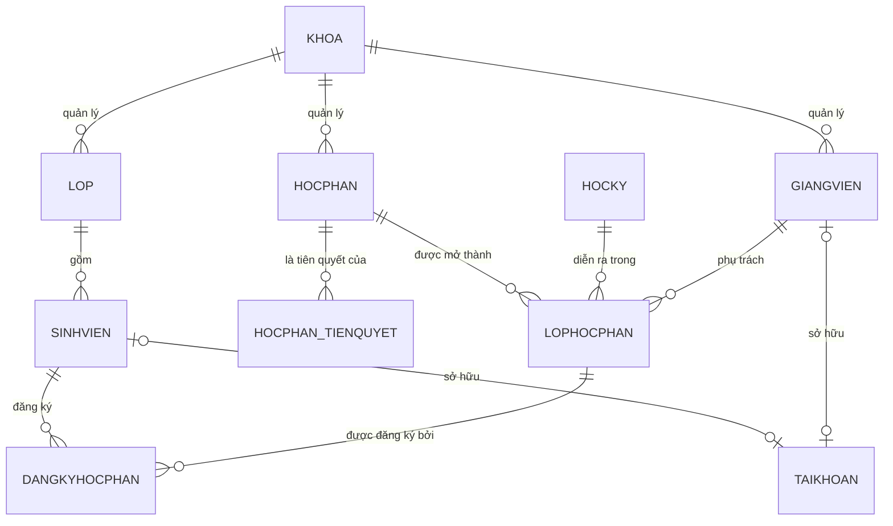

# Phân tích đề tài: Quản lý học phần tín chỉ

> Nguồn kiến thức nền: *Giáo trình hệ quản trị CSDL & SQL – ĐHCNHN* (VOER, T-SQL/SQL Server). Đề tài triển khai trên **MySQL**, nên phần 1 có kèm ghi chú chuyển đổi cú pháp.

---

## Phần 1 — Trích xuất kiến thức từ giáo trình (áp dụng cho MySQL)

### 1.1. DDL — định nghĩa dữ liệu
- `CREATE TABLE` gồm: tên cột, kiểu dữ liệu, ràng buộc cột, ràng buộc mức bảng (đặt sau khi khai báo hết cột, dùng khi ràng buộc liên quan ≥ 2 cột hoặc là khoá ngoài).
- 4 loại ràng buộc chính: `NOT NULL`, `CHECK`, `PRIMARY KEY`, `UNIQUE`, `FOREIGN KEY`.
- `FOREIGN KEY ... REFERENCES bang(cot) [ON DELETE ...] [ON UPDATE ...]` với 4 hành vi: `CASCADE`, `NO ACTION` (mặc định), `SET NULL`, `SET DEFAULT`.
- `ALTER TABLE` dùng để `ADD` cột, `ALTER COLUMN`, `DROP COLUMN`, `ADD/DROP CONSTRAINT`. Lưu ý: thêm cột `NOT NULL` vào bảng đã có dữ liệu bắt buộc phải có `DEFAULT`.
- Bảng có quan hệ vòng (A tham chiếu B, B tham chiếu A) → không thể khai báo FK ngay trong `CREATE TABLE`, phải tạo bảng trước rồi `ALTER TABLE ... ADD CONSTRAINT` sau.

**Chuyển đổi kiểu dữ liệu SQL Server → MySQL:**

| SQL Server (giáo trình) | MySQL tương đương | Ghi chú |
|---|---|---|
| `NVARCHAR(n)` / `VARCHAR(n)` | `VARCHAR(n)` | MySQL không cần tiền tố N nếu bảng dùng charset `utf8mb4` |
| `DATETIME` | `DATE` hoặc `DATETIME` | Dùng `DATE` nếu chỉ cần ngày |
| `MONEY` | `DECIMAL(12,2)` | MySQL không có kiểu MONEY |
| `BIT` | `TINYINT(1)` | MySQL không có BOOLEAN thật, alias sang TINYINT(1) |
| `IDENTITY` | `AUTO_INCREMENT` | Chỉ dùng cho khoá thay thế (surrogate key) |
| `GETDATE()` | `NOW()` / `CURDATE()` | |
| `TOP n` | `LIMIT n` | |
| `+` (nối chuỗi) | `CONCAT()` | MySQL dùng `+` cho phép toán số học |

### 1.2. DML & phép nối (JOIN)
- Giáo trình dùng cú pháp chuẩn SQL-92: `INNER JOIN`, `LEFT/RIGHT/FULL OUTER JOIN` — cú pháp này giống hệt MySQL, **trừ `FULL OUTER JOIN` MySQL không hỗ trợ trực tiếp** (phải mô phỏng bằng `LEFT JOIN UNION RIGHT JOIN`).
- Có thể nối nhiều bảng bằng cách lồng: `(A INNER JOIN B ON ...) INNER JOIN C ON ...`.

### 1.3. View
- `CREATE VIEW ten AS SELECT ...` — cú pháp giống MySQL hoàn toàn.
- `WITH CHECK OPTION`: MySQL hỗ trợ, dùng để chặn INSERT/UPDATE qua view tạo ra dòng không thoả điều kiện WHERE của view — **rất hữu ích** để giới hạn những gì giảng viên/sinh viên được sửa qua view.
- `WITH ENCRYPTION`: chỉ có ở SQL Server, **MySQL không có tương đương** — bảo mật định nghĩa view trong MySQL phải làm ở tầng quyền (không `GRANT SHOW VIEW`).

### 1.4. Bảo mật — GRANT / REVOKE
- Cú pháp `GRANT quyền ON đối_tượng TO user [WITH GRANT OPTION]` và `REVOKE ... FROM user [CASCADE]` gần như giống MySQL.
- Khác biệt: MySQL định danh user theo dạng `'user'@'host'` (ví dụ `'giangvien'@'localhost'`), và có thể `GRANT` quyền theo cột như giáo trình minh hoạ (`GRANT SELECT (hodem, ten) ON sinhvien TO ...`) — áp dụng tốt để giới hạn giảng viên chỉ `UPDATE` được đúng 3 cột điểm.

### 1.5. Stored Procedure & Function
- SQL Server: `CREATE PROC ten (@tso KIỂU [OUTPUT]) AS ...`. MySQL: `CREATE PROCEDURE ten(IN/OUT/INOUT tso KIỂU) BEGIN ... END`, cần đổi `DELIMITER` khi viết multi-statement trong client dòng lệnh.
- Hàm vô hướng (`CREATE FUNCTION ... RETURNS kiểu`): có tương đương trong MySQL, cú pháp gần giống.
- **Khác biệt quan trọng:** SQL Server có hàm trả về bảng (`RETURNS TABLE`) — **MySQL không có khái niệm này**. Muốn có "hàm trả về tập kết quả" trong MySQL, dùng **View** (nếu là 1 câu SELECT cố định) hoặc **Stored Procedure** (nếu cần logic phức tạp, nhưng không gọi được trong câu `SELECT ... FROM proc()` như SQL Server).

### 1.6. Trigger — khác biệt lớn nhất giữa hai hệ
- SQL Server: trigger có 2 bảng ảo `inserted`/`deleted` chứa **tập nhiều dòng** (vì một lệnh UPDATE/INSERT có thể ảnh hưởng nhiều dòng cùng lúc), nên giáo trình hay dùng `SELECT ... FROM inserted` kết hợp `SUM()`, `INNER JOIN` để xử lý hàng loạt.
- MySQL: trigger là **`FOR EACH ROW`** — chỉ có `NEW` và `OLD` đại diện **đúng 1 dòng** đang xử lý, không có tập nhiều dòng. Nghĩa là logic kiểu "cập nhật SUM(inserted.soluong - deleted.soluong)" trong giáo trình phải viết lại theo hướng: trigger chạy cho từng dòng, hoặc chuyển hẳn logic sang stored procedure gọi trước khi thao tác batch.
- Cú pháp: `CREATE TRIGGER ten BEFORE|AFTER INSERT|UPDATE|DELETE ON bang FOR EACH ROW BEGIN ... END`.
- Muốn huỷ thao tác + báo lỗi (thay cho `ROLLBACK TRANSACTION` trong trigger của giáo trình) → MySQL dùng:
  ```sql
  SIGNAL SQLSTATE '45000' SET MESSAGE_TEXT = 'Nội dung lỗi';
  ```
  Câu lệnh này trong trigger `BEFORE INSERT/UPDATE` sẽ chặn thao tác lại, tương đương mục đích của `ROLLBACK TRANSACTION` mà giáo trình dùng trong trigger.
- Trigger MySQL **vẫn truy vấn được các bảng khác** (kể cả `SELECT COUNT(*)`) trong thân trigger, nên các kiểm tra kiểu "còn chỗ trống", "đã tồn tại chưa" ở giáo trình áp dụng được, chỉ khác là chạy cho từng dòng thay vì cả tập.

### 1.7. Transaction
- 4 tính chất ACID (Atomicity, Consistency, Isolation, Durability) — khái niệm dùng chung, không đổi.
- Cú pháp: `BEGIN TRANSACTION / SAVE TRANSACTION / ROLLBACK TRANSACTION / COMMIT TRANSACTION` → MySQL dùng `START TRANSACTION`, `SAVEPOINT ten`, `ROLLBACK TO SAVEPOINT ten`, `ROLLBACK`, `COMMIT`.
- **Lưu ý triển khai bắt buộc:** MySQL chỉ hỗ trợ transaction + `FOREIGN KEY` trên storage engine **InnoDB** (không phải MyISAM, vốn là default cũ). Cần đảm bảo `CREATE TABLE ... ENGINE=InnoDB` (mặc định của MySQL 5.5+ trở lên rồi, nhưng nên khai báo tường minh).
- **Lưu ý về `CHECK`:** MySQL chỉ *thật sự* enforce ràng buộc `CHECK` từ bản **8.0.16 trở lên** (MariaDB từ 10.2). Bản cũ hơn parse nhưng bỏ qua lặng lẽ — cần kiểm tra version trước khi dựa vào CHECK để đảm bảo tính đúng đắn dữ liệu (ví dụ điểm phải trong khoảng 0–10).
- **Lưu ý về `ON DELETE/UPDATE SET DEFAULT`:** InnoDB *không* thực sự hỗ trợ hành vi này dù cú pháp được chấp nhận — nên chỉ dùng `CASCADE`, `SET NULL`, `RESTRICT`/`NO ACTION` trong thiết kế FK.

### 1.8. Deadlock

- **Deadlock** xảy ra khi 2 (hay nhiều) transaction giữ lock của nhau theo kiểu vòng tròn: A đang giữ lock trên dòng X, chờ lock trên dòng Y (đang bị B giữ); còn B thì đang chờ lock trên dòng X (đang bị A giữ) → cả hai kẹt vô thời hạn nếu không ai can thiệp.
- Khác với **lock wait** thông thường (chỉ cần chờ transaction kia COMMIT/ROLLBACK là tự hết), deadlock **không tự giải quyết được** vì bên nào cũng đang chờ bên còn lại.
- **InnoDB tự phát hiện deadlock**: khi phát hiện vòng lock, MySQL tự động chọn 1 transaction "rẻ" hơn (thường là transaction rollback ít work hơn) để `ROLLBACK`, transaction còn lại tiếp tục chạy. Ứng dụng sẽ nhận lỗi:
  ```
  Error 1213 (40001): Deadlock found when trying to get lock; try restarting transaction
  ```
- **Nguyên nhân điển hình trong đồ án này:** ở `sp_dangky_hocphan`, nếu 2 sinh viên đăng ký cùng lúc 2 lớp học phần khác nhau nhưng theo **thứ tự lock ngược nhau** (SV1: lock `LOPHOCPHAN A` trước rồi mới lock `LOPHOCPHAN B`; SV2: lock `B` trước rồi mới lock `A`) thì có thể tạo vòng chờ → deadlock. Trường hợp đơn giản hơn (1 SV chỉ đăng ký 1 lớp/lần gọi `sp_dangky_hocphan`) thì gần như không gặp deadlock, chỉ gặp **lock wait** ở dòng `SISOMAX`/đếm sĩ số khi nhiều SV cùng đăng ký 1 lớp (đây là lock wait bình thường, không phải deadlock).
- **Cách phòng tránh (áp dụng cho `sp_dangky_hocphan`/`sp_nhap_diem`):**
  1. Luôn lock các dòng theo **cùng một thứ tự cố định** (ví dụ luôn `SELECT ... FOR UPDATE` theo `MALHP` tăng dần) nếu một lần gọi có thể động tới nhiều dòng `LOPHOCPHAN`.
  2. Giữ transaction **càng ngắn càng tốt** — kiểm tra điều kiện xong thì `COMMIT`/`ROLLBACK` ngay, tránh có bước chờ người dùng (chờ input) ở giữa transaction.
  3. Ứng dụng phía client nên có **retry logic**: bắt lỗi `1213`/deadlock, tự gọi lại `sp_dangky_hocphan` 1–2 lần trước khi báo lỗi cho người dùng — vì đây là hành vi được dự tính (expected), không phải bug.
  4. Có thể xem lock/deadlock gần nhất bằng `SHOW ENGINE INNODB STATUS;` (mục `LATEST DETECTED DEADLOCK`) khi debug.
- **Phân biệt nhanh cho dễ nhớ khi làm báo cáo:** *Lock wait* = 1 bên chờ, tự hết khi bên kia xong. *Deadlock* = 2 bên chờ nhau, DBMS phải chủ động huỷ 1 bên mới hết.

---

## Phần 2 — Phân tích yêu cầu đề tài "Quản lý học phần tín chỉ"

### 2.1. Phạm vi & mục tiêu
Xây dựng hệ thống hỗ trợ quản lý đào tạo theo học chế tín chỉ ở quy mô một trường/khoa: danh mục học phần, mở lớp học phần theo từng học kỳ, sinh viên đăng ký học phần, giảng viên nhập điểm, tính điểm trung bình tích luỹ. **Không** bao gồm (ngoài phạm vi, theo YAGNI): học phí/thanh toán, quản lý phòng ốc/thiết bị chi tiết, xét học bổng, quản lý ký túc xá — có thể mở rộng sau nếu đề bài yêu cầu thêm.

### 2.2. Tác nhân (Actors)

| Tác nhân | Vai trò chính |
|---|---|
| **Sinh viên** | Đăng ký/huỷ đăng ký học phần, xem thời khoá biểu, xem bảng điểm & GPA |
| **Giảng viên** | Xem danh sách lớp học phần phụ trách, nhập điểm thành phần |
| **Phòng đào tạo (Admin)** | Quản lý danh mục (khoa, ngành, học phần, tiên quyết), mở lớp học phần mỗi học kỳ, đặt lịch đăng ký, khoá bảng điểm |

### 2.3. Yêu cầu chức năng theo module

**M1 — Quản lý danh mục (Admin)**
- CRUD Khoa, Ngành, Lớp hành chính, Giảng viên, Sinh viên
- CRUD Học phần: mã, tên, số tín chỉ, số tiết LT/TH, loại (bắt buộc/tự chọn), khoa quản lý
- Khai báo học phần tiên quyết (một học phần có thể có nhiều tiên quyết)

**M2 — Mở lớp học phần (Admin)**
- Tạo lớp học phần cho một học phần trong một học kỳ cụ thể: giảng viên phụ trách, sĩ số tối đa, phòng học, lịch học (thứ, tiết, số tiết)
- Mở/đóng thời gian đăng ký theo học kỳ

**M3 — Đăng ký học phần (Sinh viên)**
- Xem danh sách lớp học phần mở trong học kỳ hiện tại (lọc theo ngành/tự chọn)
- Đăng ký / huỷ đăng ký trong thời gian cho phép, hệ thống kiểm tra toàn bộ ràng buộc ở mục 2.4
- Xem thời khoá biểu cá nhân theo học kỳ

**M4 — Quản lý điểm (Giảng viên)**
- Xem danh sách sinh viên của lớp học phần mình phụ trách
- Nhập điểm chuyên cần, giữa kỳ, cuối kỳ theo trọng số quy định
- Hệ thống tự tính điểm hệ 10 → điểm chữ → điểm hệ 4

**M5 — Tra cứu & thống kê**
- Sinh viên: bảng điểm, điểm trung bình tích luỹ (GPA hệ 4, CPA hệ 10) theo học kỳ và toàn khoá
- Admin: danh sách lớp học phần theo học kỳ, tỷ lệ lấp đầy, sinh viên diện cảnh báo học vụ (CPA thấp)

**M6 — Quản trị tài khoản & phân quyền**
- Tài khoản gắn với 1 trong 3 vai trò (sinh viên/giảng viên/admin), mật khẩu lưu dạng hash
- Phân quyền theo vai trò bằng `GRANT`/`REVOKE` (mục 1.4) kết hợp kiểm tra ở tầng ứng dụng

### 2.4. Ràng buộc nghiệp vụ quan trọng
1. Sinh viên chỉ đăng ký được khi **đã hoàn thành mọi học phần tiên quyết** (điểm đạt ở lần học trước đó).
2. Lớp học phần chỉ nhận đăng ký khi **số lượng hiện tại < sĩ số tối đa**.
3. Sinh viên **không được đăng ký hai lớp học phần trùng lịch** (cùng thứ, tiết học giao nhau) trong cùng học kỳ.
4. Tổng số tín chỉ đăng ký trong một học kỳ phải nằm trong khoảng **tối thiểu–tối đa** do trường quy định (ví dụ 12–25 tín chỉ, trừ trường hợp học kỳ cuối khoá).
5. Không đăng ký lại một học phần **đã đạt** (trừ trường hợp học cải thiện, cần đánh dấu rõ `LANHOC`).
6. Đăng ký chỉ hợp lệ trong **thời gian mở đăng ký** của học kỳ.
7. Không xoá được Học phần / Lớp học phần đã có sinh viên đăng ký (toàn vẹn tham chiếu).
8. Chỉ **giảng viên phụ trách đúng lớp đó** mới được nhập/sửa điểm, và chỉ trong thời gian chưa khoá bảng điểm.

### 2.5. Yêu cầu phi chức năng
- **Bảo mật:** phân quyền theo vai trò ở cả DB (GRANT theo bảng/cột) lẫn ứng dụng; mật khẩu hash, không lưu plaintext; không hard-code credential khi đẩy code lên repo public.
- **Toàn vẹn dữ liệu:** tối đa hoá việc dùng constraint (PK/FK/CHECK/UNIQUE) ở tầng CSDL thay vì chỉ validate ở ứng dụng.
- **Hiệu năng:** đánh index trên các cột FK và cột tìm kiếm thường xuyên (MASV, MAHP, MAHK).
- **Khả năng mở rộng:** thiết kế đủ dùng cho quy mô đồ án, tránh over-engineer (không cần multi-tenant, không cần versioning chương trình đào tạo nếu đề bài không yêu cầu).

---

## Phần 3 — Phân tích CSDL (MySQL)

### 3.1. Danh sách thực thể & quan hệ

> **Điều chỉnh cho "nhẹ nhưng đủ":** 9 bảng đánh dấu **Lõi** bên dưới là đủ để có nghiệp vụ đăng ký + chấm điểm hoàn chỉnh và thể hiện trọn vẹn các kỹ thuật CSDL ở mục 3.4. Đã gộp `NGANH` vào `LOP` (bớt 1 bảng lookup không ảnh hưởng nghiệp vụ chính). `LOP` đánh dấu **Tuỳ chọn** — có thể bỏ hẳn nếu muốn nhẹ hơn nữa, đưa `MAKHOA` thẳng vào `SINHVIEN`.

| # | Thực thể | Mô tả | Mức độ |
|---|---|---|---|
| 1 | `KHOA` | Khoa quản lý | Lõi |
| 2 | `LOP` | Lớp hành chính, gộp luôn tên ngành vào cột `TENNGANH` (không tách bảng `NGANH` riêng) | Tuỳ chọn |
| 3 | `GIANGVIEN` | Giảng viên, thuộc 1 Khoa | Lõi |
| 4 | `SINHVIEN` | Sinh viên, thuộc 1 Lớp | Lõi |
| 5 | `HOCPHAN` | Học phần, thuộc 1 Khoa quản lý | Lõi |
| 6 | `HOCPHAN_TIENQUYET` | Bảng trung gian N–N: học phần ↔ học phần tiên quyết | Lõi |
| 7 | `HOCKY` | Học kỳ / năm học, có mốc thời gian đăng ký | Lõi |
| 8 | `LOPHOCPHAN` | Lớp học phần: 1 Học phần mở trong 1 Học kỳ, do 1 Giảng viên phụ trách | Lõi |
| 9 | `DANGKYHOCPHAN` | Bảng trung gian N–N: Sinh viên ↔ Lớp học phần, kèm điểm | Lõi |
| 10 | `TAIKHOAN` | Tài khoản đăng nhập, gắn với Sinh viên hoặc Giảng viên | Lõi (cần để demo phân quyền) |

**Quan hệ (cardinality):**
- `KHOA (1) — (N) LOP` (nếu bỏ `LOP`: `KHOA (1) — (N) SINHVIEN` trực tiếp)
- `KHOA (1) — (N) GIANGVIEN`
- `LOP (1) — (N) SINHVIEN`
- `KHOA (1) — (N) HOCPHAN`
- `HOCPHAN (N) — (N) HOCPHAN` qua `HOCPHAN_TIENQUYET` (tự tham chiếu)
- `HOCPHAN (1) — (N) LOPHOCPHAN`
- `HOCKY (1) — (N) LOPHOCPHAN`
- `GIANGVIEN (1) — (N) LOPHOCPHAN`
- `SINHVIEN (N) — (N) LOPHOCPHAN` qua `DANGKYHOCPHAN`
- `SINHVIEN (1) — (0..1) TAIKHOAN`, `GIANGVIEN (1) — (0..1) TAIKHOAN`



### 3.2. Đặc tả bảng dữ liệu

**KHOA**
| Cột | Kiểu | Ràng buộc |
|---|---|---|
| MAKHOA | VARCHAR(5) | PK |
| TENKHOA | VARCHAR(100) | NOT NULL |

**LOP** *(tuỳ chọn — có thể bỏ, đưa `MAKHOA` thẳng vào `SINHVIEN`)*
| Cột | Kiểu | Ràng buộc |
|---|---|---|
| MALOP | VARCHAR(10) | PK |
| TENLOP | VARCHAR(30) | NOT NULL, UNIQUE |
| TENNGANH | VARCHAR(100) | Gộp thay cho bảng `NGANH` riêng |
| MAKHOA | VARCHAR(5) | FK → KHOA |
| KHOAHOC | SMALLINT | Năm nhập học, `CHECK (khoahoc <= YEAR(CURDATE()))` |
| HEDAOTAO | ENUM('chính quy','liên thông','vừa làm vừa học') | |

**GIANGVIEN**
| Cột | Kiểu | Ràng buộc |
|---|---|---|
| MAGV | VARCHAR(10) | PK |
| HOTEN | VARCHAR(50) | NOT NULL |
| NGAYSINH | DATE | |
| GIOITINH | TINYINT(1) | |
| HOCVI | VARCHAR(30) | |
| MAKHOA | VARCHAR(5) | FK → KHOA |
| EMAIL | VARCHAR(100) | UNIQUE |

**SINHVIEN**
| Cột | Kiểu | Ràng buộc |
|---|---|---|
| MASV | VARCHAR(10) | PK |
| HOTEN | VARCHAR(50) | NOT NULL |
| NGAYSINH | DATE | |
| GIOITINH | TINYINT(1) | |
| MALOP | VARCHAR(10) | FK → LOP |
| NGAYNHAPHOC | DATE | |
| TRANGTHAI | ENUM('đang học','bảo lưu','thôi học','tốt nghiệp') | DEFAULT 'đang học' |

**HOCPHAN**
| Cột | Kiểu | Ràng buộc |
|---|---|---|
| MAHP | VARCHAR(10) | PK |
| TENHP | VARCHAR(100) | NOT NULL |
| SOTINCHI | TINYINT UNSIGNED | `CHECK (sotinchi > 0)` |
| SOTIETLT | SMALLINT UNSIGNED | |
| SOTIETTH | SMALLINT UNSIGNED | |
| LOAIHP | ENUM('bắt buộc','tự chọn') | NOT NULL |
| MAKHOA | VARCHAR(5) | FK → KHOA |

**HOCPHAN_TIENQUYET**
| Cột | Kiểu | Ràng buộc |
|---|---|---|
| MAHP | VARCHAR(10) | PK (phần 1), FK → HOCPHAN |
| MAHP_TIENQUYET | VARCHAR(10) | PK (phần 2), FK → HOCPHAN, `CHECK (mahp <> mahp_tienquyet)` |

**HOCKY**
| Cột | Kiểu | Ràng buộc |
|---|---|---|
| MAHK | VARCHAR(10) | PK, vd `2025-2026-HK1` |
| NAMHOC | VARCHAR(9) | NOT NULL |
| HOCKYTHU | TINYINT | 1, 2 hoặc 3 (hè) |
| NGAYBATDAU / NGAYKETTHUC | DATE | |
| HANDANGKY_BD / HANDANGKY_KT | DATETIME | Cửa sổ thời gian mở đăng ký |

**LOPHOCPHAN**
| Cột | Kiểu | Ràng buộc |
|---|---|---|
| MALHP | VARCHAR(15) | PK |
| MAHP | VARCHAR(10) | FK → HOCPHAN, `ON DELETE RESTRICT` |
| MAHK | VARCHAR(10) | FK → HOCKY |
| MAGV | VARCHAR(10) | FK → GIANGVIEN |
| SISOMAX | SMALLINT UNSIGNED | NOT NULL |
| PHONGHOC | VARCHAR(20) | |
| THU | TINYINT | 2–8 (thứ 2–CN) |
| TIETBATDAU | TINYINT | |
| SOTIET | TINYINT | |
| TRANGTHAI | ENUM('mở','đóng','huỷ') | DEFAULT 'mở' |

**DANGKYHOCPHAN**
| Cột | Kiểu | Ràng buộc |
|---|---|---|
| MASV | VARCHAR(10) | PK (phần 1), FK → SINHVIEN |
| MALHP | VARCHAR(15) | PK (phần 2), FK → LOPHOCPHAN, `ON DELETE RESTRICT` |
| NGAYDANGKY | DATETIME | DEFAULT NOW() |
| LANHOC | ENUM('lần 1','học lại','cải thiện') | DEFAULT 'lần 1' |
| DIEMCHUYENCAN | DECIMAL(4,2) | `CHECK (0<=x<=10)`, NULL cho đến khi nhập |
| DIEMGIUAKY | DECIMAL(4,2) | `CHECK (0<=x<=10)` |
| DIEMCUOIKY | DECIMAL(4,2) | `CHECK (0<=x<=10)` |
| DIEMHE10 | DECIMAL(4,2) | Tính từ 3 cột trên theo trọng số |
| DIEMCHU | CHAR(2) | Tính từ DIEMHE10 (A, B+, B, ... F) |
| DIEMHE4 | DECIMAL(3,2) | Tính từ DIEMCHU |
| TRANGTHAI | ENUM('đăng ký','đã huỷ') | DEFAULT 'đăng ký' |

**TAIKHOAN**
| Cột | Kiểu | Ràng buộc |
|---|---|---|
| MATK | INT AUTO_INCREMENT | PK |
| TENDANGNHAP | VARCHAR(50) | UNIQUE, NOT NULL |
| MATKHAU_HASH | VARCHAR(255) | NOT NULL |
| VAITRO | ENUM('sinhvien','giangvien','admin') | NOT NULL |
| MASV | VARCHAR(10) | FK → SINHVIEN, NULL nếu vai trò khác |
| MAGV | VARCHAR(10) | FK → GIANGVIEN, NULL nếu vai trò khác |

### 3.3. Ánh xạ ràng buộc nghiệp vụ → cơ chế triển khai MySQL

| Ràng buộc (mục 2.4) | Cơ chế đề xuất |
|---|---|
| (1) Phải hoàn thành tiên quyết | Stored procedure `sp_dangky_hocphan`: kiểm tra mọi `MAHP_TIENQUYET` của `MAHP` đã có bản ghi `DANGKYHOCPHAN` với `DIEMHE10 >= 4` trước khi `INSERT` |
| (2) Còn chỗ trong lớp | Trigger `BEFORE INSERT ON DANGKYHOCPHAN`: `SELECT COUNT(*)` các dòng cùng `MALHP`, so với `SISOMAX` của `LOPHOCPHAN`, nếu đầy → `SIGNAL SQLSTATE '45000'` |
| (3) Không trùng lịch | Đặt trong cùng stored procedure ở (1): `JOIN` các `LOPHOCPHAN` khác mà SV đã đăng ký trong cùng `MAHK`, so sánh `THU` + khoảng `TIETBATDAU..TIETBATDAU+SOTIET` |
| (4) Tổng tín chỉ min–max | Cùng stored procedure: `SUM(SOTINCHI)` qua `JOIN HOCPHAN` của các lớp học phần SV đã/đang đăng ký trong học kỳ đó |
| (5) Không đăng ký lại HP đã đạt | Kiểm tra trong stored procedure, cho phép ngoại lệ khi `LANHOC IN ('học lại','cải thiện')` |
| (6) Trong thời gian mở đăng ký | So `NOW()` với `HANDANGKY_BD`/`HANDANGKY_KT` của `HOCKY`, kiểm tra ngay đầu stored procedure |
| (7) Không xoá HP/LHP đã có SV đăng ký | `FOREIGN KEY ... ON DELETE RESTRICT` từ `DANGKYHOCPHAN` → `LOPHOCPHAN` (đã đặt sẵn ở 3.2) |
| (8) Đúng giảng viên phụ trách mới nhập điểm, chưa khoá | `GRANT UPDATE (diemchuyencan, diemgiuaky, diemcuoiky) ON DANGKYHOCPHAN TO 'giangvien'@'%'` + kiểm tra `MAGV` ở tầng ứng dụng theo phiên đăng nhập; khoá điểm bằng cột `TRANGTHAI` trên `HOCKY` + trigger `BEFORE UPDATE` chặn sửa khi học kỳ đã khoá |
| Tự tính điểm chữ/hệ 4 | Trigger `BEFORE INSERT/UPDATE ON DANGKYHOCPHAN`: tính `DIEMHE10` từ 3 cột thành phần theo trọng số, rồi `CASE WHEN` ra `DIEMCHU`/`DIEMHE4` |

**Vì sao dùng stored procedure thay vì để ứng dụng tự kiểm tra từng điều kiện:** các ràng buộc (1)(3)(4)(5)(6) đều liên quan đến việc đọc dữ liệu từ nhiều bảng trước khi quyết định cho phép `INSERT`, nên gom vào một stored procedure `sp_dangky_hocphan(masv, malhp)` giúp đảm bảo tính nguyên tử (atomic) — toàn bộ kiểm tra + ghi dữ liệu nằm trong một transaction, tránh race-condition khi nhiều sinh viên đăng ký cùng lúc (đặc biệt quan trọng cho ràng buộc sĩ số).

### 3.4. Checklist kỹ thuật CSDL cần thể hiện

Với 9 bảng lõi + nghiệp vụ đăng ký/chấm điểm ở mục 2, đây là danh sách tối thiểu để bài làm "chạm" đủ các chương trong giáo trình (mục 1) — mỗi dòng là một đối tượng CSDL cụ thể cần có, không phải khái niệm chung chung:

| Kỹ thuật (giáo trình) | Đối tượng cụ thể cần tạo | Vì sao chọn chỗ này |
|---|---|---|
| Ràng buộc CHECK/UNIQUE/FK | `CHECK` trên điểm (0–10), số tín chỉ (>0); `UNIQUE` trên email GV, tên lớp; `FK ... ON DELETE RESTRICT` (HOCPHAN, LOPHOCPHAN) và `ON DELETE CASCADE` (DANGKYHOCPHAN theo SINHVIEN) | Đã liệt kê đủ ở mục 3.2 — không cần thêm |
| View | `v_lophocphan_conCho` (lớp còn chỗ trống: `SISOMAX - COUNT(dangky)`), `v_bangdiem_sinhvien` (JOIN phẳng SV–LHP–HP–điểm) | 2 view là đủ để thể hiện chương 4, không cần nhiều hơn |
| Stored Procedure | `sp_dangky_hocphan(masv, malhp)` — gom toàn bộ 6 kiểm tra ở mục 3.3 trong 1 transaction; `sp_nhap_diem(masv, malhp, cc, gk, ck)` | Đây là phần "nặng" nhất về nghiệp vụ, nên đầu tư kỹ nhất ở đây thay vì dàn trải nhiều bảng |
| Function | 1 hàm vô hướng `fn_diem_chu(diem10)` — trả điểm chữ từ điểm hệ 10 | Đủ để thể hiện chương Hàm, không cần hàm dạng bảng (MySQL không hỗ trợ tốt, xem mục 1.5) |
| Trigger | `trg_kiemtra_siso` (BEFORE INSERT DANGKYHOCPHAN), `trg_tinh_diem` (BEFORE INSERT/UPDATE DANGKYHOCPHAN — tự tính DIEMHE10/DIEMCHU/DIEMHE4), `trg_khoa_diem` (BEFORE UPDATE — chặn sửa khi học kỳ đã khoá) | 3 trigger, mỗi cái minh hoạ một cơ chế khác nhau (kiểm tra điều kiện, tính toán tự động, chặn thao tác) |
| Transaction | Thân của `sp_dangky_hocphan` bọc `START TRANSACTION ... COMMIT`, có `ROLLBACK` khi 1 trong 6 điều kiện sai | Đây là ví dụ transaction thật, không phải minh hoạ suông |
| Bảo mật (GRANT/REVOKE) | 3 role MySQL: `admin_role` (toàn quyền danh mục), `giangvien_role` (`SELECT` toàn bộ + `UPDATE` 3 cột điểm của `DANGKYHOCPHAN`), `sinhvien_role` (`SELECT` qua 2 view ở trên, `EXECUTE` trên `sp_dangky_hocphan`) | Tương ứng đúng chương 5 của giáo trình, và trực tiếp giải quyết ràng buộc (8) ở mục 2.4 |

Làm đủ bảng trên là đã bao phủ 6/7 chương trong giáo trình (trừ DML/JOIN cơ bản — mặc nhiên có ở mọi câu SELECT) mà không cần mở rộng thêm bảng hay module nghiệp vụ nào khác.

### 3.5. Lưu ý khi triển khai
- Tất cả bảng dùng `ENGINE=InnoDB` để FK + transaction hoạt động.
- Kiểm tra version MySQL trước khi dựa vào `CHECK` (mục 1.7) — nếu bản cũ, chuyển các `CHECK` quan trọng (điểm 0–10, số tín chỉ > 0) thành trigger để chắc chắn được enforce.
- `sp_dangky_hocphan` nên bọc trong `START TRANSACTION ... COMMIT`, và cân nhắc `SELECT ... FOR UPDATE` trên dòng đếm sĩ số để tránh hai sinh viên cùng "lọt" vào chỗ cuối cùng khi đăng ký đồng thời. Xem mục 1.8 về deadlock: nếu 1 lần gọi có thể lock nhiều `LOPHOCPHAN`, nhớ lock theo thứ tự cố định (`MALHP` tăng dần) và có retry logic ở ứng dụng cho lỗi `1213`.
- Không commit thông tin kết nối DB (host/user/password) lên repo public — dùng biến môi trường/file `.env` bị `.gitignore`.

---

**Gợi ý bước tiếp theo:** nếu cần, mình có thể viết sẵn phần use-case diagram/đặc tả use case chi tiết hơn cho từng chức năng ở mục 2.3, hoặc dựng file dữ liệu mẫu (sample data) để test các stored procedure ở mục 3.3 — báo mình khi cần.
